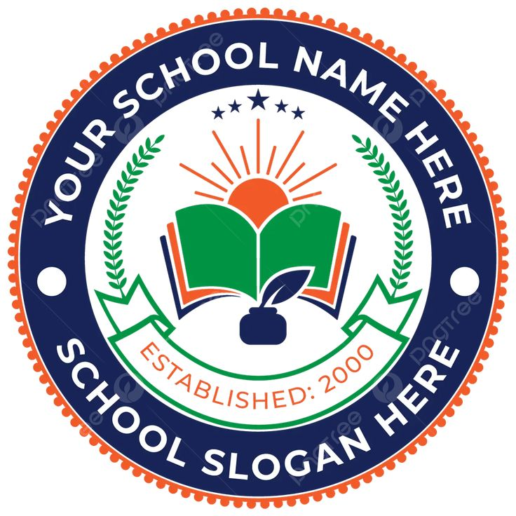

# منصة إنجازات المدرسة

# ملف تقديم المشروع — إدارة المدرسة

---

## صفحة الغلاف

> **اسم المشروع:** منصة إنجازات المدرسة

> **اسم الجهة:** مدرسة بيان الأهلية

> **مقدم المشروع:** إدارة المدرسة

> **التاريخ:** أغسطس 2026

> **رقم الإصدار:** الإصدار الأول (v1.0)



---

## الملخص التنفيذي

### المشكلة

تعاني المدرسة من تشتت الإنجازات المدرسية بين وسائل متعددة (الواتساب، الصور على الأجهزة، ملفات ورقية مبعثرة)، مما يؤدي إلى صعوبة الوصول إلى أي إنجاز قديم وضياع كثير من الأعمال بعد انتهاء العام الدراسي، وغياب توثيق رسمي موحد.

### الحل

منصة إلكترونية موحدة لتوثيق جميع إنجازات المدرسة (صور، فيديوهات، مستندات) بطريقة احترافية مع البحث والتصنيف والأرشفة وإمكانية المشاركة والطباعة.

### الفائدة

حفظ تاريخ المدرسة، إبراز جهود المعلمات، تسهيل إعداد التقارير، وتحسين الصورة المؤسسية أمام الإدارة والمجتمع.

### لماذا تستحق الاعتماد؟

لأنها تحول العمل اليدوي المتفرق إلى نظام رقمي آمن وحديث يدعم الجودة والاعتماد المدرسي.

---

## أولاً: المشكلة الحالية

تعاني المدرسة من التحديات التالية:

| # | المشكلة |
|---|---------|
| 1 | الإنجازات موزعة بين الصور على الجوال، والواتساب، والملفات على الأجهزة المختلفة |
| 2 | صعوبة الوصول إلى أي إنجاز قديم أو البحث فيه |
| 3 | عدم وجود توثيق رسمي موحد يحفظ كل إنجاز مع مرافقه |
| 4 | ضياع كثير من الأعمال والصور بعد انتهاء العام الدراسي أو تغيير الأجهزة |
| 5 | صعوبة تجهيز تقارير الوزارة أو لجان الجودة في وقت قصير |
| 6 | عدم إبراز جهود المعلمات والطلاب أمام المجتمع بشكل منظم |
| 7 | غياب نظام للتصنيف يسهّل العرض والتواصل مع الأقسام المختلفة |

---

## ثانياً: الحل المقترح

منصة إلكترونية موحدة لتوثيق جميع إنجازات المدرسة بطريقة احترافية:

- تتيح لكل معلمة رفع إنجازاتها مع صور وفيديوهات ومستندات مباشرة من الهاتف أو الكمبيوتر.
- تصنّف الإنجازات تلقائياً حسب القسم والمعلمة والتاريخ.
- توفر محرك بحث فوري للوصول إلى أي إنجاز في ثوانٍ.
- تنشئ تقارير مطبوعة جاهزة في أي لحظة.
- تعرض الإنجازات بتصميم عصري جذاب يليق بمكانة المدرسة.

---

## ثالثاً: أهداف المشروع

1. توثيق جميع الأنشطة والإنجازات المدرسية في مكان واحد.
2. حفظ تاريخ المدرسة وسجل إنجازاتها لسنوات قادمة.
3. إبراز جهود المعلمات والطلاب وإعطائهن التقدير المستحق.
4. تسهيل إعداد التقارير للوزارة ولجان الجودة.
5. تحسين الصورة المؤسسية للمدرسة أمام المجتمع والجهات الرسمية.
6. دعم معايير الجودة والاعتماد المدرسي من خلال أرشيف رقمي منظم.

---

## رابعاً: الفئات المستفيدة

| الفئة | كيف تستفيد |
|-------|-----------|
| **الإدارة** | مراجعة وتقييم الإنجازات، عرض الإحصائيات، إعداد التقارير |
| **المعلمات** | توثيق إنجازاتهن بسهولة والاطلاع على إنجازات الزميلات |
| **الطلاب** | الاطلاع على أنشطة المدرسة والإنجازات المشتركة |
| **أولياء الأمور** | متابعة نشاط المدرسة والاطلاع على الإنجازات |
| **لجان الجودة** | الوصول المباشر للأرشيف المنظم عند التقييم |
| **الزائرون** | الاطلاع على الإنجازات عبر شاشات العرض واللوحة الرقمية |
| **الوزارة** | تلقي التقارير الجاهزة الداعمة للجودة والاعتماد |

---

## خامساً: مميزات النظام

| # | الميزة | الوصف |
|---|--------|-------|
| 1 | رفع صور وفيديوهات | إمكانية إرفاق أكثر من صورة وفيديو لكل إنجاز (حتى 50 ميجابايت) |
| 2 | رفع ملفات PDF ومستندات | دعم ملفات PDF وWord ونصية وأرشيفات ZIP/RAR |
| 3 | تصنيف حسب القسم | عرض الإنجازات مقسمة على الأقسام (رياضيات، علوم، ...) |
| 4 | تصنيف حسب المعلمة | تتبع إنجازات كل معلمة على حدة |
| 5 | تصنيف حسب التاريخ | ترتيب الإنجازات تلقائياً حسب تاريخ الإنجاز |
| 6 | البحث السريع | محرك بحث فوري يعرض النتائج أثناء الكتابة |
| 7 | لوحة تحكم للإدارة | إحصائيات حية وتقييم الإنجازات (ذهبي/فضي/برونزي) |
| 8 | صلاحيات مستخدمين | حماية التعديل والحذف برموز PIN فريدة لكل إنجاز |
| 9 | واجهة عربية كاملة | تصميم من اليمين لليسار بالكامل بلغة عربية واضحة |
| 10 | يعمل من الهاتف والكمبيوتر | تصميم متجاوب يعمل على أي جهاز بدون تثبيت تطبيق |
| 11 | سرعة الوصول | فتح أي إنجاز بثوانٍ عبر محرك البحث أو الفلاتر |
| 12 | تصميم احترافي | هوية بصرية موحدة بأسلوب Kahoot (ألوان نابضة وتأثيرات حركية) |
| 13 | طباعة التقارير | تصدير PDF وExcel مع الصور والروابط مباشرة |
| 14 | عرض تلقائي لشاشات الاستقبال | وضع كشك يعرض الإنجازات والصور بشكل مستمر |
| 15 | صيانة البيانات | أداة فحص وتنظيف التخزين السحابي من الإعدادات |

---

## سادساً: رحلة الاستخدام

```
المعلمة تفتح الرابط
       ↓
صفحة الترحيب (اسم المدرسة + الشعار + الرؤية)
       ↓
   تضغط "دخول"
       ↓
الصفحة الرئيسية ← "إضافة إنجاز"
       ↓
تعبئة البيانات + رفع المرفقات + تحديد رمز PIN
       ↓
  الضغط على "حفظ"
       ↓
الإنجاز يظهر فوراً على الموقع
       ↓
المديرة تقيّم الإنجاز (ذهبي / فضي / برونزي)
       ↓
التقارير والطباعة متاحة فوراً
```

---

## سابعاً: صور من النظام

> **ملاحظة للمقدّم:** تُضاف لقطات الشاشة التالية من واجهة الموقع المباشر. ضع كل صورة باسمها في مجلد `images/` بجانب هذا الملف، وستظهر تلقائياً في أماكنها الصحيحة:
>
> `images/02-home.png` · `images/04-add-achievement.png` · `images/05-full-record.png` · `images/10-admin-login.png` · `images/09-achievement-detail.png` · `images/01-intro.png` · `images/06-honor-roll.png` · `images/08-kiosk.png` · `images/03-home-mobile.png`

### 1. الصفحة الرئيسية


*الصفحة الرئيسية: ترحيب، إحصائيات، جدول أحدث الإنجازات.*

### 2. صفحة إضافة إنجاز


*نموذج إضافة الإنجاز: بيانات المعلمة، القسم، العنوان، الوصف، التاريخ، المرفقات، ورمز الحماية.*

### 3. السجل الكامل


*السجل الكامل: بحث وفلترة وتصدير PDF وExcel.*

### 4. لوحة تحكم الإدارة


*لوحة تحكم الإدارة: مراجعة وتقييم الإنجازات.*

### 5. صفحات البحث والفلترة


*البحث السريع والفلترة حسب القسم والتقييم.*

### 6. تفاصيل الإنجاز


*عرض تفصيلي للإنجاز مع الصور والفيديو والمستندات والطباعة.*

### 7. صفحة الترحيب (Intro)


*الصفحة الترحيبية المتحركة: اسم المدرسة، الشعار، الرؤية، الرسالة، المديرة والمساعدتان.*

### 8. لوحة الشرف


*لوحة الشرف: منصة المتميزات ذهب/فضة/برونز.*

### 9. شاشة الكشك


*وضع الكشك: عرض تلقائي على شاشات الاستقبال والمعارض.*

### 10. الصفحة الرئيسية على الجوال


*واجهة متجاوبة بالكامل على شاشات الجوال.*

---

## ثامناً: الجوانب التقنية

| الجانب | التفاصيل |
|--------|---------|
| **يعمل عبر الإنترنت** | متاح من أي مكان عبر المتصفح بدون تثبيت تطبيق |
| **قاعدة بيانات آمنة** | Firebase Firestore — تخزين سحابي آمن مع نسخ احتياطي تلقائي |
| **نسخ احتياطي** | Firebase وCloudinary يوفران نسخاً احتياطية تلقائية مستمرة |
| **سرعة تحميل** | بناء حديث (Next.js 16) يضمن سرعة تحميل عالية |
| **تصميم متجاوب** | يعمل بسلاسة على الجوال (390px) والكمبيوتر (1920px+) |
| **صلاحيات مستخدمين** | حماية الإعدادات برمز PIN، وحماية كل إنجاز برمز PIN خاص |
| **قابل للتطوير** | كود TypeScript احترافي يسهل إضافة ميزات جديدة مستقبلاً |
| **تخزين الوسائط** | Cloudinary — تخزين سحابي مخصص للصور والفيديو والمستندات |
| **واجهة عربية** | تصميم RTL كامل باللغة العربية بخط Tajawal المحسّن |

---

## تاسعاً: الأمان وحماية البيانات

| # | الإجراء | التفاصيل |
|---|---------|---------|
| 1 | تسجيل دخول محدود | لا يمكن الدخول للإدارة إلا برمز PIN مع حد أقصى لمحاولات الدخول |
| 2 | صلاحيات مختلفة | المعلمة تضيف فقط، الإدارة تقيّم وتُدير، الزوار يشاهدون |
| 3 | حماية البيانات | رموز الحماية مشفرة في قاعدة البيانات ولا يمكن كشفها |
| 4 | منع الوصول غير المصرح به | لا يمكن تعديل أو حذف إنجاز إلا برمز PIN الخاص به أو بصلاحية الإدارة |
| 5 | نسخ احتياطية | Firebase وCloudinary يوفران نسخاً احتياطية تلقائية |
| 6 | حماية على مستوى الخادم | جميع العمليات الحساسة تتم عبر خادم موثق ومراقب |
| 7 | تنقية المدخلات | تنقية جميع النصوص المُدخلة من أي محتوى ضار (حماية من حقن الأكواد) |
| 8 | حماية الملفات | التحقق من نوع الملف وحجمه من الخادم قبل قبول أي رفع |

---

## عاشراً: القيمة المضافة

### الطريقة القديمة (بدون النظام)

| الميزة | الحالة |
|--------|--------|
| حفظ الإنجازات | صور متفرقة على الجوال والواتساب |
| البحث عن إنجاز قديم | مستحيل تقريباً |
| الأرشيف | غير موجود — ضياع مع نهاية العام |
| إعداد التقارير | يدوي ويتطلب جهداً كبيراً ووقتاً طويلاً |
| العرض أمام الإدارة | صور عشوائية بدون تنظيم أو تصميم احترافي |
| مشاركة الإنجازات | عبر واتساب فقط بشكل غير منظم |

### النظام الجديد (منصة إنجازات المدرسة)

| الميزة | الحالة |
|--------|--------|
| حفظ الإنجازات | أرشيف دائم على السحابة مع صور وفيديوهات ومستندات |
| البحث عن إنجاز قديم | بحث فوري بأي كلمة أو قسم أو معلمة |
| الأرشيف | أرشيف منظم يبقى لسنوات قادمة |
| إعداد التقارير | تقارير PDF وExcel جاهزة بنقرة واحدة |
| العرض أمام الإدارة | تصميم احترافي على شاشات الاستقبال أو كشك العرض |
| مشاركة الإنجازات | رابط مباشر للمنصة يمكن مشاركته بأي طريقة |

---

## الحادي عشر: خطة التوسع المستقبلي

| المرحلة | الميزة المقترحة |
|---------|---------------|
| **قريبة المدى** | إشعارات فورية عند إضافة إنجاز جديد أو تقييمه |
| **قريبة المدى** | تصدير التقارير تلقائياً بالبريد الإلكتروني |
| **متوسطة المدى** | تطبيق هاتف أصلي (Android / iOS) لتسهيل الاستخدام |
| **متوسطة المدى** | إحصائيات مقارنة متقدمة (أداء الأقسام عبر الأشهر) |
| **بعيدة المدى** | ذكاء اصطناعي لتصنيف الإنجازات تلقائياً واقتراح التقييم |
| **بعيدة المدى** | لوحة مؤشرات حية (Dashboard) للإدارة مع رسوم بيانية |
| **بعيدة المدى** | ربط النظام مع نظام المدرسة لإدخال التقييمات تلقائياً |

---

## الثاني عشر: التكلفة والعائد

### التكلفة

| البند | التكلفة الشهرية |
|-------|----------------|
| الاستضافة (Vercel) | مجاناً للبداية |
| قاعدة البيانات (Firebase) | مجاناً في الحدود المعتادة |
| تخزين الوسائط (Cloudinary) | خطة مجانية كافية للبداية — قابلة للتوسع |
| **الإجمالي** | **مجاني في البداية** |

### العائد (الفائدة)

| البند | الفائدة |
|-------|---------|
| تقليل الوقت | إعداد تقرير في ثوانٍ بدلاً من ساعات |
| تقليل فقدان البيانات | حفظ دائم على السحابة لا يضيع مع تغيير الأجهزة |
| سهولة استخراج التقارير | تصدير PDF وExcel بنقرة واحدة |
| تحسين صورة المدرسة | عرض احترافي يليق بالمجتمع المدرسي |
| توثيق الإنجازات لسنوات | أرشيف رقمي يبقى مرجعاً دائماً |

---

## الثالث عشر: الخاتمة

يمثل هذا المشروع منصة رقمية متكاملة لتوثيق إنجازات المدرسة وحفظها وعرضها بصورة احترافية. ويسهم في رفع كفاءة العمل الإداري، وتسهيل إعداد التقارير، وإبراز جهود المدرسة أمام الجهات الرسمية والمجتمع.

المنصة جاهزة للاستخدام اليومي وقابلة للتطوير المستمر حسب احتياجات المدرسة.

---

## ملحق (أ): دليل استخدام مختصر للمستخدم

### خطوات إضافة إنجاز جديد

1. افتحي رابط الموقع من المتصفح.
2. اضغطي زر "دخول" من صفحة الترحيب.
3. اضغطي "إضافة إنجاز" من الشريط الجانبي أو الصفحة الرئيسية.
4. اختاري المعلمة والقسم وأدخلي عنوان الإنجاز والوصف.
5. اختاري تاريخ الإنجاز.
6. أنشئي رمز حماية من 4 أرقام (يُحفظ ويُستخدم عند التعديل).
7. ارفقي الصور أو الفيديو أو المستندات (اختياري).
8. اضغطي "حفظ".

### خطوات عرض الإنجاز

1. من الصفحة الرئيسية أو السجل الكامل، ابحثي عن الإنجاز.
2. اضغطي على "عرض" لفتح صفحة التفاصيل.
3. يمكنك تكبير الصور ومشاهدة الفيديو وتحميل المستندات وطباعة الصفحة.

### خطوات تعديل أو حذف إنجاز

1. افتحي صفحة تفاصيل الإنجاز.
2. اضغطي زر "تعديل" أو "حذف".
3. أدخلي رمز الحماية (PIN) الخاص بهذا الإنجاز.
4. أجري التعديل أو أكّدي الحذف.

---

## ملحق (ب): دليل مدير النظام

### الدخول للإدارة

1. من الشريط الجانبي اضغطي "دخول الإدارة".
2. أدخلي رمز PIN الخاص بالإدارة.
3. يمكنك تغييره من صفحة الإعدادات > الأمان.

### إدارة الإنجازات

- من لوحة الإدارة: راجعي الإنجازات المعلقة وقيّميها ذهبي/فضي/برونزي.
- من السجل الكامل: صدّري جميع البيانات إلى Excel أو PDF.
- من صفحة التفاصيل: احذفي أي مرفق برموز الحماية.

### إدارة الإعدادات

**الهوية العامة:** اسم المدرسة، الشعار، الهاتف، العنوان (تظهر تلقائياً في كل الصفحات).

**القيادة:** اسم المديرة والمساعدتان والرؤية والرسالة (تظهر في صفحة الترحيب).

**الأقسام والمعلمات:** إضافة أو تعديل أو حذف الأقسام وأسماء المعلمات (تظهر في نماذج الإضافة والتقارير).

**الأمان:** تغيير رمز PIN للإدارة.

**صيانة البيانات:** فحص التخزين السحابي واكتشاف وحذف الملفات المعطلة أو المعزولة.

### إنشاء تقارير

1. من صفحة "طباعة التقارير": اختاري التقرير (حسب القسم أو المعلمة).
2. اضغطي "تصدير PDF" أو "طباعة" لطباعته مباشرة.
3. من السجل الكامل: اختاري "تصدير Excel" لتنزيل ملف بيانات.

---

## ملحق (ج): ملخص تنفيذي من صفحة واحدة

> **هذا الملخص هو أول ما يقرأه مدير المدرسة أو الإدارة، وغالباً يحدد انطباعهم عن المشروع قبل الاطلاع على بقية التفاصيل.**

| | |
|---|---|
| **اسم المشروع** | منصة إنجازات المدرسة |
| **المشكلة** | الإنجازات موزعة وضائعة، لا يوجد أرشيف أو توثيق رسمي موحد |
| **الحل** | منصة رقمية موحدة لتوثيق الإنجازات مع بحث وتصنيف وتقارير وعرض احترافي |
| **الفائدة** | حفظ التاريخ، تسهيل التقارير، إبراز الجهود، دعم الجودة والاعتماد |
| **المستفيدون** | الإدارة، المعلمات، الطلاب، أولياء الأمور، لجان الجودة، الزوار |
| **المميزات** | صور + فيديو + مستندات، تصنيف، بحث، PDF/Excel، تصميم متجاوب بالعربية |
| **التكلفة** | مجانية في البداية (استضافة + قاعدة بيانات + تخزين سحابي) |
| **الحالة** | **جاهز للاستخدام** |

---

*أُعدّ هذا الملف لتقديم المشروع إلى إدارة المدرسة. جميع المعلومات مستمدة من النظام الفعلي.*
